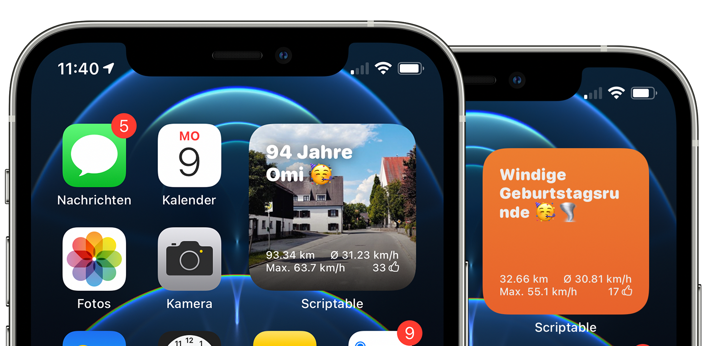

# Strava Scriptable Widget

A simple script to display your latest Strava activity inside a [Scriptable](https://scriptable.app) widget.
To display your latest activity, you'll need a [Strava Developer](https://developers.strava.com) account. I've created a little Shortcuts workflow to help you with your needed credentials.

### 1. Create a Strava Developer Account

This is free but mandatory in order to get every data correctly. So head over to [Strava Developer](https://developers.strava.com) to and create a new app. Let's call it **Scriptable Widget**. Please fill out everything you see and yes, Strava wants you to put in an image. This can be a photo of your last piece of pizza! 🍕

1. Create a new Strava App

2. Fill out every detail

3. Set **call-back domain** to `developers.strava.com`

When you're done, you should be able to see your **ClientID** and **Client Secret**

### 2. Run the Shortcuts Workflow

[Download this Shortcut](https://www.icloud.com/shortcuts/6f1cb1820cc143c4ac081a1276acb8b9) and paste your **Client ID** and **Client Secret**.
*If your a first time user of Shortcuts, you need to run a basic shortcut once, switch to your phone's settings > shortcuts and allow to run other scripts. Afterwards the script should run fine.*

#### What's going to happen:

After you entered your **Client ID** and you're **Client Secret** the shortcut opens Safari and tells you to authenticate your app, after a successful authentication you'll see an empy Safari page **this is intended and not a bug!** 
You need to copy this page by tapping on the little share-sheet icon in the bottom right corner and select **Copy**. When you copied the page, press **done** in the upper left corner. The Shortcut now creates everything you need and passes the parameters to your clipboard. Now you're ready to go.

### 3. Install the Widget

Download and install **strava.js** to you and place the small widget on your homescreen. Long-tap the widget and select *Edit "Scriptable"* . For Script select the Strava Script you just created, for Parameters past the Parameters you just created with the Shortcut. (They should be in your clipboard).

## Next Steps

- [ ]  Offline fallback, if API is offline

- [ ]  Highlight Image as background

- [ ]  Medium and Large Widget?
